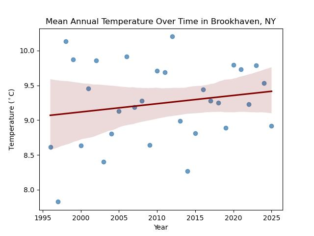

## Claire Wadler - Water Quality Scientist
Portfolio showcasing my environmental data science projects.

#### Contact Information
* clairewadler@gmail.com
* [View my GitHub Profile](https://github.com/clairewadler)
* [View my ORCID](https://orcid.org/0009-0006-9958-7316)

### About Me

I currently work for the Colorado Department of Public Health and Environment in the Water Quality Control Division as a PFAS Program Specialist. When I first moved to Colorado in 2023, I worked as a Research Assistant at the WE2ST Hub in Colorado School of Mines, where I did chemical characterization work on recycled water. Before moving to Colorado, I attended Georgia State University and researched transit time distributions in urban beaver ponds. I have also lived in Oklahoma, where I worked for the EPA's Groundwater Characterization and Remediation Division, and Austin, where I attended the University of Texas. My interest in studying water quality began as a child growing up in Houston, TX, where in the aftermath of floods and hurricanes, we would sometimes go weeks without clean tap water. I continue to seek opportunities that will help me grow as a water quality professional and contribute to creating sustainable outcomes within our watersheds.

#### Professional Background
* 05/2025 - Present &emsp;&nbsp; PFAS Program Specialist, CDPHE
* 06/2023 - 06/2025 &emsp; Research Assistant, Colorado School of Mines
* 12/2022 - 05/2023 &emsp; GIS Intern, City of Sandy Springs

#### Educational Background
* MS Geosciences, Georgia State University, Atlanta, GA, 2023
* BSA Chemistry, University of Texas, Austin, TX, 2017

### Projects
I will be posting my projects and assignments for the Earth Data Analytics Certificate program here. I am excited to learn how to apply programming languages to analyze environmental data, particularly hydrologic data, and explore how to automate my workflows.

*Temperature Data Show Temperatures have Increased Over a 30 Year Period in Brookhaven, NY, created 9/2026*

Long Island has been identified as a region particularly prone to climate change impacts. Brookhaven is a town located in central Long Island, and has warmed an average of 0.01&deg;C per year from 1996 to 2025. This is a slightly [slower rate][1] than has been predicted. To see more details on this project, [you can find the full analysis here.](portfolio_posts/portfolio_export_2)

[1]: https://nysclimateimpacts.org/explore-by-region/the-long-island-region/#section-8

*Interactive Map of Schlitterbahn Waterpark in New Braunfels, created 9/2026*

<embed type="text/html" src="img/Schlitterbahn.html" width="600" height="600">
